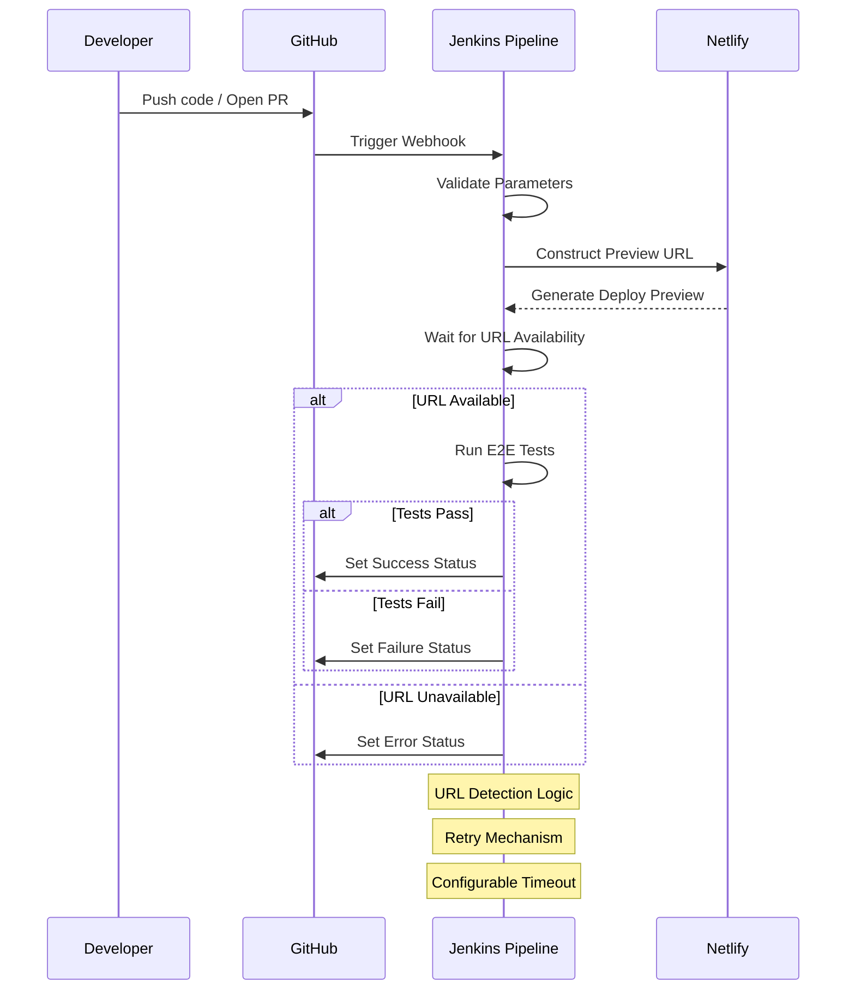

# Wait for Netlify - A Jenkins Pipeline ⏱️

## Overview
Are you using Lighthouse, Cypress, or other testing tools that depend on Netlify Preview URLs? This Jenkins pipeline ensures your URL is fully available before running critical tasks.

## Workflow Diagram

## Motivation
Streamline the process of running End-to-End (E2E) tests against Netlify preview deployments, ensuring that tests are only executed when the preview URL is fully available and responsive.

## Prerequisites
- Jenkins GitHub Plugin installed
- GitHub Webhook Configuration
  - Manual Webhook Setup
  - Reference Guides:
    - [Jenkins GitHub Plugin Documentation](https://plugins.jenkins.io/github/#plugin-content-manual-mode)
    - [GitHub Webhook Delivery Management](https://docs.github.com/en/webhooks/using-webhooks/handling-webhook-deliveries#update-the-webhook-url)

### Webhook Configuration Steps
1. In your GitHub repository, navigate to Settings > Webhooks
2. Add Jenkins webhook URL
3. Choose events to trigger the webhook (e.g., Push, Pull Request)
4. Ensure Jenkins can receive and process webhook payloads

## Key Features
- Automatic PR and branch preview URL detection
- URL availability verification
- Configurable deployment settings
- Flexible error handling
- Placeholder stages for E2E testing integration

## Parameters
- `SITE_NAME`: Netlify site name
- `BRANCH_NAME`: Branch or PR name
- `IS_PR`: Automatic PR detection
- `MAX_TIMEOUT`: URL availability wait time
- `BASE_PATH`: Preview URL base path
- `FAIL_ON_ERROR`: Control pipeline behavior on URL failure

## URL Construction
- PR deployments: `https://deploy-preview-{PR_NUMBER}--{SITE_NAME}.netlify.app`
- Branch deployments: `https://{sanitized_branch_name}--{SITE_NAME}.netlify.app`

## Installation
- Just copy the [pipeline script](Jenkinsfile) to your Jenkins pipeline configuration

## Customization
- Adapt E2E test stages to your testing framework
- Modify timeout and error handling as needed

## Troubleshooting
- Verify webhook URL is correct and accessible
- Check Jenkins logs for webhook processing errors
- Ensure network connectivity between GitHub and Jenkins

## Inspired By
[JakePartusch/wait-for-netlify-action](https://github.com/JakePartusch/wait-for-netlify-action)
